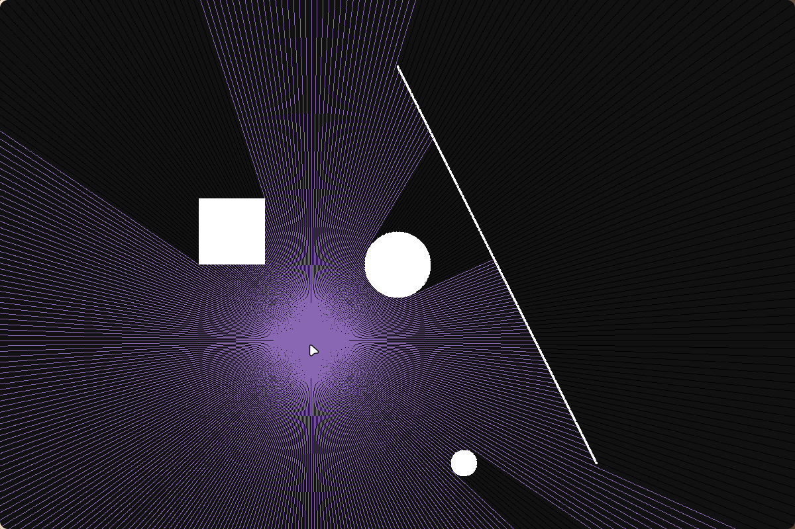
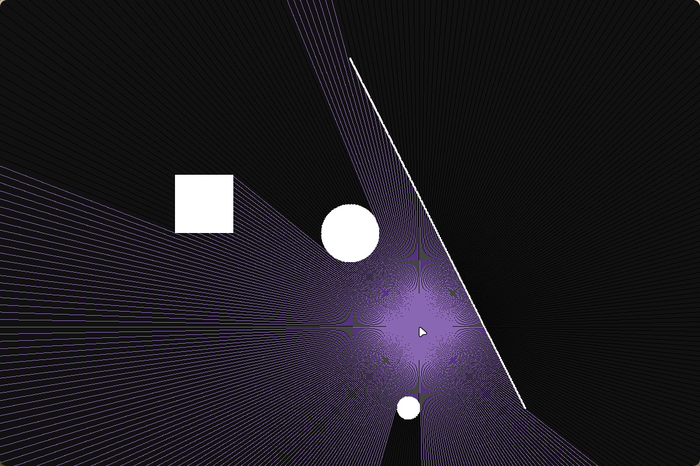

#2D Raytracing

This project implements 2D Ray Tracing, a technique to simulate how rays of light interact with objects in a 2D environment. Rays are emitted from a source (e.g., a point or a circle) and check for collisions with objects such as rectangles, lines, or circles. These intersections are used to calculate light paths and shadows.

